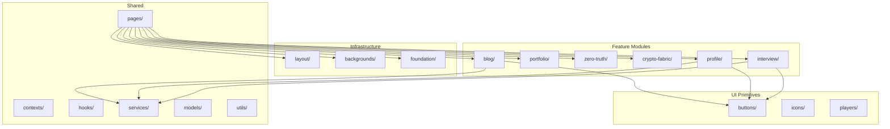

# Phase 7: Update Documentation

## Objective

Update all documentation to reflect the new feature-based, domain-driven architecture. Ensure all README files comply with `.cursorrules` requirements and provide clear guidance for developers working with the reorganized codebase.

## Prerequisites

- Phase 1-6 completed (all components moved, renamed, infrastructure created, imports updated, barrel exports created)
- New architecture is functional and tested

## Documentation Updates Required

### 1. Update Root README.md

**File:** `README.md`

**Updates needed:**

- Remove or update the "A Note on the Current Structure" section (line 36-38)
- Add section describing the new feature-based architecture
- Update project structure description
- Add link to architecture documentation

**New content to add:**

```markdown
## Architecture

This project follows a **feature-based, domain-driven architecture** that organizes code by business domain rather than technical layer. This structure reflects the sophisticated, thought-provoking nature of the site's content and enables:

- Clear separation of concerns
- Easy feature discovery
- Scalable codebase organization
- Enterprise-grade maintainability

### Key Architectural Principles

- **Feature Modules**: Code organized by domain (blog, portfolio, zero-truth, etc.)
- **UI Primitives**: Reusable components separated from feature-specific code
- **Layout Components**: Shared layout and navigation components
- **Foundation**: Core infrastructure (SEO, etc.)

See [src/README.md](src/README.md) for detailed architecture documentation.
```

### 2. Update src/README.md

**File:** `src/README.md`

**Major updates needed:**

- Replace old directory structure with new feature-based structure
- Add comprehensive architecture overview
- Document feature module patterns
- Add architecture diagrams (Mermaid)
- Update implementation guidelines
- Ensure all `.cursorrules` required sections are present

**Required sections per `.cursorrules`:**

1. Architecture Overview
2. Implementation Guidelines
3. Performance Metrics
4. Security Measures
5. Testing Requirements
6. Documentation Requirements

**New directory structure to document:**

```
src/
├── features/                    # Feature-based modules
│   ├── blog/                    # Blog content management
│   ├── portfolio/              # Portfolio showcases
│   ├── zero-truth/             # Zero Truth philosophical content
│   ├── crypto-fabric/          # Crypto Fabric concept
│   ├── interview/               # Interview experience
│   └── profile/                # Professional profile sections
├── ui/                          # Reusable UI primitives
│   ├── buttons/
│   ├── icons/
│   └── players/
├── layout/                      # Layout components
├── backgrounds/                 # Background/animation components
├── foundation/                  # Core infrastructure
│   └── seo/
├── pages/                       # Page-level components
├── contexts/                    # React contexts
├── hooks/                       # Shared hooks
├── services/                    # Client-side services
├── models/                      # Type definitions
├── data/                        # Static data
└── utils/                       # Utilities
```

**Architecture diagram to add:**



**Feature module pattern documentation:**

```markdown
## Feature Module Pattern

Each feature module follows a consistent structure:

```

features/{feature-name}/

├── components/          # Feature-specific components

├── hooks/              # Feature-specific hooks (optional)

├── types.ts           # Feature-specific types

├── index.ts           # Barrel exports

└── README.md          # Feature documentation

````

### Import Patterns

**Using barrel exports:**
```typescript
import { Blog, BlogPost } from './features/blog';
import { HeroSection, AboutMeSection } from './features/profile';
````

**Direct imports (when needed):**

```typescript
import { Blog } from './features/blog/components/Blog';
```

**UI primitives:**

```typescript
import { InteractiveButton } from './ui/buttons';
import { XIcon } from './ui/icons';
```

**Layout and infrastructure:**

```typescript
import { MainNav, ContactFooter } from './layout';
import { AnimatedBackground } from './backgrounds';
import { Seo } from './foundation/seo';
```
````

### 3. Update Feature Module READMEs

**Files to update (created in Phase 4, now need content review):**
- `src/features/blog/README.md`
- `src/features/portfolio/README.md`
- `src/features/zero-truth/README.md`
- `src/features/crypto-fabric/README.md`
- `src/features/interview/README.md`
- `src/features/profile/README.md`

**Ensure each includes:**
- Purpose and domain description
- Component overview with usage examples
- Types documentation
- Hooks documentation (if applicable)
- Dependencies on other modules
- Integration examples

### 4. Update Directory READMEs

**Files to review and enhance:**
- `src/ui/README.md` (created in Phase 1)
- `src/layout/README.md` (created in Phase 1)
- `src/backgrounds/README.md` (created in Phase 1)
- `src/foundation/README.md` (created in Phase 1)
- `src/features/README.md` (created in Phase 1)

**Ensure each includes:**
- Clear purpose statement
- When to add components here vs elsewhere
- Usage guidelines
- Examples
- Related directories

### 5. Create Architecture Decision Record (Optional but Recommended)

**File:** `docs/ARCHITECTURE.md` or add to `src/README.md`

**Content to include:**
- Why feature-based architecture was chosen
- Benefits over previous flat structure
- Migration rationale
- Future considerations

### 6. Update .cursorrules Compliance

**File:** `.cursorrules`

**Review and update if needed:**
- Verify README requirements match new structure
- Ensure feature modules are documented
- Update any architecture patterns if needed

**Current requirements check:**
- ✅ READMEs required in: `src`, `src/services`, `functions`, `functions/src/__tests__`
- ✅ Required sections: Architecture Overview, Implementation Guidelines, Performance Metrics, Security Measures, Testing Requirements, Documentation Requirements

**Considerations:**
- May want to add feature modules to required README locations
- May want to document feature module pattern in architecture section

### 7. Update src/services/README.md

**File:** `src/services/README.md`

**Updates needed:**
- Reference new feature-based structure
- Update any examples that reference old component paths
- Ensure alignment with new architecture

### 8. Create Migration Guide (Optional)

**File:** `docs/MIGRATION.md` or section in `src/README.md`

**Content:**
- Summary of changes
- Before/after comparison
- Import path migration guide
- Common patterns

## Documentation Structure

### src/README.md Structure

```markdown
# Frontend Source Directory - Feature-Based Architecture

## Architecture Overview
[Comprehensive overview with diagrams]

## Directory Structure
[Detailed structure with explanations]

## Feature Module Pattern
[Pattern documentation with examples]

## Implementation Guidelines
[Updated guidelines for new structure]

## Import Patterns
[Barrel exports, direct imports, examples]

## Performance Metrics
[Updated with new structure considerations]

## Security Measures
[Updated if needed]

## Testing Requirements
[Updated test patterns for feature modules]

## Documentation Requirements
[Updated requirements]
````

## Architecture Diagrams

### Main Architecture Diagram

Create Mermaid diagram showing:

- Feature modules
- UI primitives
- Infrastructure layers
- Shared resources
- Dependencies between layers

### Feature Module Detail Diagram

Create diagram showing:

- Internal structure of a feature module
- Relationship between components, hooks, types
- Barrel export pattern

### Import Flow Diagram

Create diagram showing:

- How pages import from features
- How features import from UI/layout
- How shared resources are used

## Validation Checklist

After documentation updates:

- [ ] Root README.md updated
- [ ] src/README.md completely rewritten with new architecture
- [ ] All feature module READMEs reviewed and complete
- [ ] All directory READMEs (ui, layout, backgrounds, foundation, features) complete
- [ ] Architecture diagrams added (Mermaid)
- [ ] Import patterns documented
- [ ] Feature module pattern documented
- [ ] .cursorrules compliance verified
- [ ] src/services/README.md updated
- [ ] All examples use new import paths
- [ ] Migration guide created (if applicable)
- [ ] Documentation is clear and actionable

## Documentation Quality Standards

### Clarity

- Use clear, concise language
- Provide concrete examples
- Include code snippets
- Explain "why" not just "what"

### Completeness

- Cover all major concepts
- Document patterns and conventions
- Include migration information
- Reference related documentation

### Accuracy

- Verify all paths are correct
- Test all code examples
- Ensure diagrams match reality
- Update outdated information

### Discoverability

- Use clear headings
- Include table of contents if needed
- Cross-reference related docs
- Use consistent terminology

## Mermaid Diagram Guidelines

### Architecture Overview Diagram

- Show high-level structure
- Group related items
- Show dependencies
- Use clear labels

### Feature Module Diagram

- Show internal structure
- Show external dependencies
- Include barrel export pattern
- Show component relationships

### Import Flow Diagram

- Show import paths
- Group by category
- Show direction of dependencies
- Highlight barrel exports

## Examples to Include

### Feature Module Usage

```typescript
// Importing from feature module
import { Blog, BlogPost } from './features/blog';
import { HeroSection } from './features/profile';

// Using in page component
export const BlogPage = () => {
  return <Blog />;
};
```

### UI Primitive Usage

```typescript
import { InteractiveButton } from './ui/buttons';
import { XIcon } from './ui/icons';

export const MyComponent = () => {
  return (
    <div>
      <InteractiveButton onClick={handleClick} />
      <XIcon size={24} />
    </div>
  );
};
```

### Layout Usage

```typescript
import { MainNav, ContactFooter } from './layout';

export const Page = () => {
  return (
    <>
      <MainNav />
      <main>Content</main>
      <ContactFooter />
    </>
  );
};
```

## Dependencies

- Requires Phases 1-6 completion
- Final phase of reorganization
- Sets foundation for future development

## Post-Completion

After Phase 7:

- Architecture is fully documented
- Developers can easily understand structure
- New features can follow established patterns
- Codebase reflects sophisticated content
- Enterprise-grade organization achieved